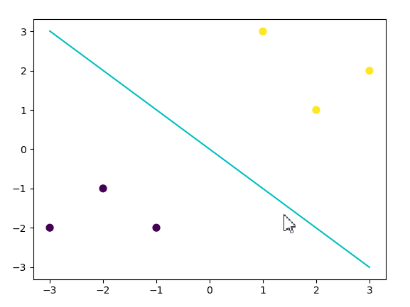

# 支持向量机学习

## 引用

[机器学习算法（五）: 基于支持向量机的分类预测](https://developer.aliyun.com/ai/scenario/b6c1ef3172d84236ae10c3b91798a796)

## 简介

> 支持向量机（Support Vector Machine，SVM）是一个非常优雅的算法，具有非常完善的数学理论，常用于数据分类，也可以用于数据的回归预测中，由于其优美的理论保证和利用核函数对于线性不可分问题的处理技巧， 在上世纪90年代左右，SVM曾红极一时。 本文将不涉及非常严格和复杂的理论知识，力求于通过直觉来感受 SVM。

## 原理

TODO

## 示例

### demo

#### 模型训练、预测

```python
## 基础函数库
import numpy as np
## 导入画图库
import matplotlib.pyplot as plt
import seaborn as sns
## 导入逻辑回归模型函数
from sklearn import svm

##Demo演示LogisticRegression分类
## 构造数据集
x_fearures = np.array([[-1, -2], [-2, -1], [-3, -2], [1, 3], [2, 1], [3, 2]])
y_label = np.array([0, 0, 0, 1, 1, 1])
## 调用SVC模型 （支持向量机分类）
svc = svm.SVC(kernel='linear')
## 用SVM模型拟合构造的数据集
svc = svc.fit(x_fearures, y_label)

## 查看其对应模型的w
print('the weight of Logistic Regression:',svc.coef_)
## 查看其对应模型的w0
print('the intercept(w0) of Logistic Regression:',svc.intercept_)

## 模型预测
y_train_pred = svc.predict(x_fearures)
print('The predction result:',y_train_pred)

# 最佳函数
x_range = np.linspace(-3, 3)
w = svc.coef_[0]
a = -w[0] / w[1]
y_3 = a*x_range - (svc.intercept_[0]) / w[1]
```

#### 模型可视化

```python
# 可视化决策边界
plt.figure()
plt.scatter(x_fearures[:,0],x_fearures[:,1], c=y_label, s=50, cmap='viridis')
plt.plot(x_range, y_3, '-c')
plt.show()
```




## 问题

1.什么是支持向量
2.支持向量机的推导
3.SVM的损失函数
4.SVM的核函数有哪些，核函数的作用是什么
5.硬间隔和软间隔
6.SVM可以做多分类吗，怎么做
7.SVM可以做回归吗，怎么做
8.SVM的对偶问题，为什么要把原问题转化为对偶问题
9.KKT限制条件有哪些