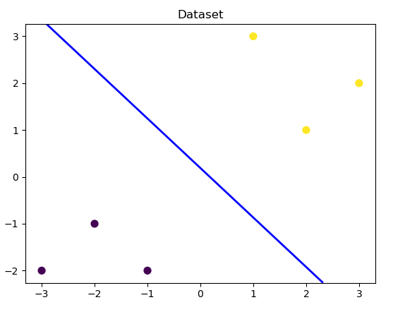

# 逻辑回归学习


## 引用

[机器学习算法（一）: 基于逻辑回归的分类预测](https://developer.aliyun.com/ai/scenario/9ad3416619b1423180f656d1c9ae44f7?spm=5176.12901015.0.i12901015.6954525cek8m36)

[逻辑回归理解及公式推导](https://www.jianshu.com/p/0cfabca442d9)

## 简介

> ​	逻辑回归（Logistic regression，简称LR）虽然其中带有"回归"两个字，但逻辑回归其实是一个分类模型，并且广泛应用于各个领域之中。虽然现在深度学习相对于这些传统方法更为火热，但实则这些传统方法由于其独特的优势依然广泛应用于各个领域中。
> ​	而对于逻辑回归而且，最为突出的两点就是其模型简单和模型的可解释性强。
> ​	逻辑回归模型的优劣势:
>
> 1. 优点：实现简单，易于理解和实现；计算代价不高，速度很快，存储资源低；
> 2. 缺点：容易欠拟合，分类精度可能不高


## 应用

> ​	逻辑回归模型广泛用于各个领域，包括机器学习，大多数医学领域和社会科学。
>
> ​	例如，最初由Boyd 等人开发的创伤和损伤严重度评分（TRISS）被广泛用于预测受伤患者的死亡率，使用逻辑回归 基于观察到的患者特征（年龄，性别，体重指数,各种血液检查的结果等）分析预测发生特定疾病（例如糖尿病，冠心病）的风险。
>
> ​	逻辑回归模型也用于预测在给定的过程中，系统或产品的故障的可能性。
>
> ​	还用于市场营销应用程序，例如预测客户购买产品或中止订购的倾向等。
>
> ​	在经济学中它可以用来预测一个人选择进入劳动力市场的可能性，而商业应用则可以用来预测房主拖欠抵押贷款的可能性。
>
> ​	条件随机字段是逻辑回归到顺序数据的扩展，用于自然语言处理。
> ​	逻辑回归模型现在同样是很多分类算法的基础组件,比如 分类任务中基于GBDT算法+LR逻辑回归实现的信用卡交易反欺诈，CTR(点击通过率)预估等。
>
> ​	其好处在于输出值自然地落在0到1之间，并且有概率意义。模型清晰，有对应的概率学理论基础。它拟合出来的参数就代表了每一个特征(feature)对结果的影响。也是一个理解数据的好工具。但同时由于其本质上是一个线性的分类器，所以不能应对较为复杂的数据情况。很多时候我们也会拿逻辑回归模型去做一些任务尝试的基线（基础水平）。


## 原理

> Logistic回归虽然名字里带“回归”，但是它实际上是一种分类方法，主要用于两分类问题（即输出只有两种，分别代表两个类别），所以利用了Logistic函数（或称为Sigmoid函数），函数形式为：
> $$
> log_i(z)=\frac{1}{1+e^{-z}}
> $$
> 
>
> 通过上图我们可以发现 Logistic 函数是单调递增函数，并且在z=0的时候取值为0.5，并且 函数的取值范围为(0,1)。
>
> 而回归的基本方程为 ：
> $$
> z=w_0+\sum_{i}^N{w_ix_i}
> $$
> 


## 示例

### demo演示LogisticRegression分类

#### 模型训练

```python
##  基础函数库
## 导入画图库
import matplotlib.pyplot as plt
import numpy as np
## 导入逻辑回归模型函数
from sklearn.linear_model import LogisticRegression

##Demo演示LogisticRegression分类
## 构造数据集
x_fearures = np.array([[-1, -2], [-2, -1], [-3, -2], [1, 3], [2, 1], [3, 2]])
y_label = np.array([0, 0, 0, 1, 1, 1])
## 调用逻辑回归模型
lr_clf = LogisticRegression()
## 用逻辑回归模型拟合构造的数据集
lr_clf = lr_clf.fit(x_fearures, y_label)  # 其拟合方程为 y=w0+w1*x1+w2*x2
```

#### 参数查看

```python
## 查看其对应模型的w
print('the weight of Logistic Regression:', lr_clf.coef_)
## 查看其对应模型的w0
print('the intercept(w0) of Logistic Regression:', lr_clf.intercept_)
```

#### 数据和模型可视化

```python
# 可视化决策边界
plt.figure()
# x：x坐标值数组； y：y坐标值数组； c：颜色数组； s：坐标点的大小 cmp：Colormap实体或者是一个colormap的名字
# [参数1：选择第几个集合，参数2：选择集合中第几个元素]
plt.scatter(x_fearures[:, 0], x_fearures[:, 1], c=y_label, s=50, cmap='viridis')
plt.title('Dataset')
nx, ny = 200, 100
# x轴上的最小值和最大值
x_min, x_max = plt.xlim()
y_min, y_max = plt.ylim()
print("[x_min,x_max,y_min,y_max]:", [x_min, x_max, y_min, y_max])
# np.linspace(start,end,num) 生成等差数列
# np.meshgrid生成网格点坐标矩阵
x_grid, y_grid = np.meshgrid(np.linspace(x_min, x_max, nx), np.linspace(y_min, y_max, ny))
# x_grid.ravel()将多维数组降为到一维
# np.c_()按行连接两个矩阵，就是把两矩阵左右相加，原来的一维的相加变成二维
k = np.c_[x_grid.ravel(), y_grid.ravel()]
# lr_clf.predict_proba预测每个点属于0，1的概率
z_proba = lr_clf.predict_proba(k)
# 取预测为1的概率，reshape()按照x_grid的格式重新生成对应维度的矩阵，用于最后画图展示
z_proba = z_proba[:, 1].reshape(x_grid.shape)
plt.contour(x_grid, y_grid, z_proba, [0.5], linewidths=2., colors='blue')
plt.show()
```



##### 可视化预测新样本

```python
### 可视化预测新样本
plt.figure()
## new point 1
x_fearures_new1 = np.array([[0, -1]])
plt.scatter(x_fearures_new1[:, 0], x_fearures_new1[:, 1], s=50, cmap='viridis')
plt.annotate(s='New point 1', xy=(0, -1), xytext=
(-2, 0), color='blue', arrowprops=dict(arrowstyle='-|>', connectionstyle='arc3', color='red'))
## new point 2
x_fearures_new2 = np.array([[1, 2]])
plt.scatter(x_fearures_new2[:, 0], x_fearures_new2[:, 1], s=50, cmap='viridis')
plt.annotate(s='New point 2', xy=(1, 2), xytext=
(-1.5, 2.5), color='red', arrowprops=dict(arrowstyle='-|>', connectionstyle='arc3', color='red'))
## 训练样本
plt.scatter(x_fearures[:, 0], x_fearures[:, 1], c=y_label, s=50, cmap='viridis')
plt.title('Dataset')
# 可视化决策边界
plt.contour(x_grid, y_grid, z_proba, [0.5], linewidths=2., colors='blue')
plt.show()
```


#### 模型预测

```python
## 在训练集和测试集上分布利用训练好的模型进行预测
y_label_new1_predict = lr_clf.predict(x_fearures_new1)
y_label_new2_predict = lr_clf.predict(x_fearures_new2)
print('The New point 1 predict class:\n', y_label_new1_predict)
print('The New point 2 predict class:\n', y_label_new2_predict)
## 由于逻辑回归模型是概率预测模型（前文介绍的 p = p(y=1|x,\theta)）,所有我们可以利用 predict_proba 函数预测其概率
y_label_new1_predict_proba = lr_clf.predict_proba(x_fearures_new1)
y_label_new2_predict_proba = lr_clf.predict_proba(x_fearures_new2)
print('The New point 1 predict Probability of each class:\n', y_label_new1_predict_proba)
print('The New point 2 predict Probability of each class:\n', y_label_new2_predict_proba)
```


### 基于鸢尾花（iris）数据集的逻辑回归分类实践

> 本次我们选择鸢花数据（iris）进行方法的尝试训练，该数据集一共包含5个变量，其中4个特征变量，1个目标分类变量。共有150个样本，目标变量为 花的类别 其都属于鸢尾属下的三个亚属，分别是山鸢尾 (Iris-setosa)，变色鸢尾(Iris-versicolor)和维吉尼亚鸢尾(Iris-virginica)。包含的三种鸢尾花的四个特征，分别是花萼长度(cm)、花萼宽度(cm)、花瓣长度(cm)、花瓣宽度(cm)，这些形态特征在过去被用来识别物种。

| 变量         | 描述                                                         |
| ------------ | ------------------------------------------------------------ |
| sepal length | 花萼长度(cm)                                                 |
| sepal width  | 花萼宽度(cm)                                                 |
| petal length | 花瓣长度(cm)                                                 |
| petal width  | 花瓣宽度(cm)                                                 |
| target       | 鸢尾的三个亚属类别,'setosa'(0), 'versicolor'(1), 'virginica'(2) |

#### 数据集加载、预览

```python
##  基础函数库
## 绘图函数库
import matplotlib.pyplot as plt
import pandas as pd
import seaborn as sns
## 我们利用 sklearn 中自带的 iris 数据作为数据载入，并利用Pandas转化为DataFrame格式
from sklearn.datasets import load_iris

data = load_iris()  # 得到数据特征
iris_target = data.target  # 得到数据对应的标签
iris_features = pd.DataFrame(data=data.data, columns=data.feature_names)  # 利用Pandas转化为DataFrame格式

## 利用.info()查看数据的整体信息
print(iris_features.info())

## 进行简单的数据查看，我们可以利用 .head() 头部.tail()尾部
print(iris_features.head())
print(iris_features.tail())

## 其对应的类别标签为，其中0，1，2分别代表'setosa', 'versicolor', 'virginica'三种不同花的类别。
print(iris_target)

## 利用value_counts函数查看每个类别数量
print(pd.Series(iris_target).value_counts())

## 对于特征进行一些统计描述
print(iris_features.describe())
```

#### 数据可视化

##### 两个特征

因为是二维坐标，所以展示的是2个特征之间，两两组合的情况。

```python
## 合并标签和特征信息
iris_all = iris_features.copy()  ##进行深拷贝，防止对于原始数据的修改
iris_all['target'] = iris_target
## 特征与标签组合的散点可视化
## 因为是2D的坐标系，(x,y)是特征两两组合，点的颜色是标签
# diag_kind：对角线的图类型；hue：data中的标签变量，对应到不同的颜色
sns.pairplot(data=iris_all, diag_kind='hist', hue='target')
plt.show()
```


##### 单个特征

```python
for col in iris_features.columns:
    # saturation：控制用于绘制颜色的原始饱和度的比例。；palette：调色板名称，列表或字典
    sns.boxplot(x='target', y=col, saturation=0.5, palette='pastel', data=iris_all)
    plt.title(col)
    plt.show()
```


##### 三个特征

```python
# 选取其前三个特征绘制三维散点图
fig = plt.figure(figsize=(10, 8))
# 创建3d图形
ax = fig.add_subplot(111, projection='3d')
iris_all_class0 = iris_all[iris_all['target'] == 0].values
iris_all_class1 = iris_all[iris_all['target'] == 1].values
iris_all_class2 = iris_all[iris_all['target'] == 2].values
# 'setosa'(0), 'versicolor'(1), 'virginica'(2)
ax.scatter(iris_all_class0[:, 0], iris_all_class0[:, 1], iris_all_class0[:, 2], label='setosa')
ax.scatter(iris_all_class1[:, 0], iris_all_class1[:, 1], iris_all_class1[:, 2], label='versicolor')
ax.scatter(iris_all_class2[:, 0], iris_all_class2[:, 1], iris_all_class2[:, 2], label='virginica')
# 添加图例
plt.legend()
plt.show()
```


#### 模型训练、预测

二、三分类区别在于输入数据集中标签的类别个数

##### 二分类

```python
import matplotlib.pyplot as plt
import pandas as pd
import seaborn as sns
## 我们利用 sklearn 中自带的 iris 数据作为数据载入，并利用Pandas转化为DataFrame格式
from sklearn.datasets import load_iris

data = load_iris()  # 得到数据特征
iris_target = data.target  # 得到数据对应的标签
iris_features = pd.DataFrame(data=data.data, columns=data.feature_names)  # 利用Pandas转化为DataFrame格式
iris_all = iris_features.copy()  ##进行深拷贝，防止对于原始数据的修改
iris_all['target'] = iris_target

## 为了正确评估模型性能，将数据划分为训练集和测试集，并在训练集上训练模型，在测试集上验证模型性能。
from sklearn.model_selection import train_test_split
## 选择其类别为0和1的样本 （不包括类别为2的样本）
iris_features_part = iris_features.iloc[:100]
iris_target_part = iris_target[:100]
## 测试集大小为20%， 80%/20%分
x_train, x_test, y_train, y_test = train_test_split(iris_features_part, iris_target_part,
test_size = 0.2, random_state = 2020)
## 从sklearn中导入逻辑回归模型
from sklearn.linear_model import LogisticRegression
## 定义 逻辑回归模型
clf = LogisticRegression(random_state=0, solver='lbfgs')
# 在训练集上训练逻辑回归模型
clf.fit(x_train, y_train)

## 查看其对应的w
print('the weight of Logistic Regression:',clf.coef_)
## 查看其对应的w0
print('the intercept(w0) of Logistic Regression:',clf.intercept_)


## 在训练集和测试集上分布利用训练好的模型进行预测
train_predict = clf.predict(x_train)
test_predict = clf.predict(x_test)
from sklearn import metrics
## 利用accuracy（准确度）【预测正确的样本数目占总预测样本数目的比例】评估模型效果
print('The accuracy of the Logistic Regression is:',metrics.accuracy_score(y_train,train_predict))
print('The accuracy of the Logistic Regression is:',metrics.accuracy_score(y_test,test_predict))
## 查看混淆矩阵 (预测值和真实值的各类情况统计矩阵)
confusion_matrix_result = metrics.confusion_matrix(test_predict,y_test)
print('The confusion matrix result:\n',confusion_matrix_result)
# 利用热力图对于结果进行可视化
plt.figure(figsize=(8, 6))
sns.heatmap(confusion_matrix_result, annot=True, cmap='Blues')
plt.xlabel('Predicted labels')
plt.ylabel('True labels')
plt.show()
```


可以看出FP、FN都是0，所以样本都预测正确了。

##### 三分类

```python
# 利用逻辑回归模型在多分类上进行训练和预测
## 测试集大小为20%， 80%/20%分
x_train, x_test, y_train, y_test = train_test_split(iris_features, iris_target, test_size =
0.2, random_state = 2020)
## 定义 逻辑回归模型
clf = LogisticRegression(random_state=0, solver='lbfgs')
# 在训练集上训练逻辑回归模型
clf.fit(x_train, y_train)

## 查看其对应的w
print('the weight of Logistic Regression:\n',clf.coef_)
## 查看其对应的w0
print('the intercept(w0) of Logistic Regression:\n',clf.intercept_)
## 由于这个是3分类，所有我们这里得到了三个逻辑回归模型的参数，其三个逻辑回归组合起来即可实现三分类。


## 在训练集和测试集上分布利用训练好的模型进行预测
train_predict = clf.predict(x_train)
test_predict = clf.predict(x_test)
## 由于逻辑回归模型是概率预测模型（前文介绍的 p = p(y=1|x,\theta)）,所有我们可以利用 predict_proba 函数预测其概率
train_predict_proba = clf.predict_proba(x_train)
test_predict_proba = clf.predict_proba(x_test)
print('The test predict Probability of each class:\n',test_predict_proba)
## 其中第一列代表预测为0类的概率，第二列代表预测为1类的概率，第三列代表预测为2类的概率。
## 利用accuracy（准确度）【预测正确的样本数目占总预测样本数目的比例】评估模型效果
print('The accuracy of the Logistic Regression is:',metrics.accuracy_score(y_train,train_predict))
print('The accuracy of the Logistic Regression is:',metrics.accuracy_score(y_test,test_predict))
```


通过结果我们可以发现，其在三分类的结果的预测准确度上有所下降，其在测试集上的准确度为: 86.67%，这是
由于'versicolor'（1）和 'virginica'（2）这两个类别的特征，我们从可视化的时候也可以发现，其特征的边界具有一定的模糊性（边界类别混杂，没有明显区分边界），所有在这两类的预测上出现了一定的错误。

